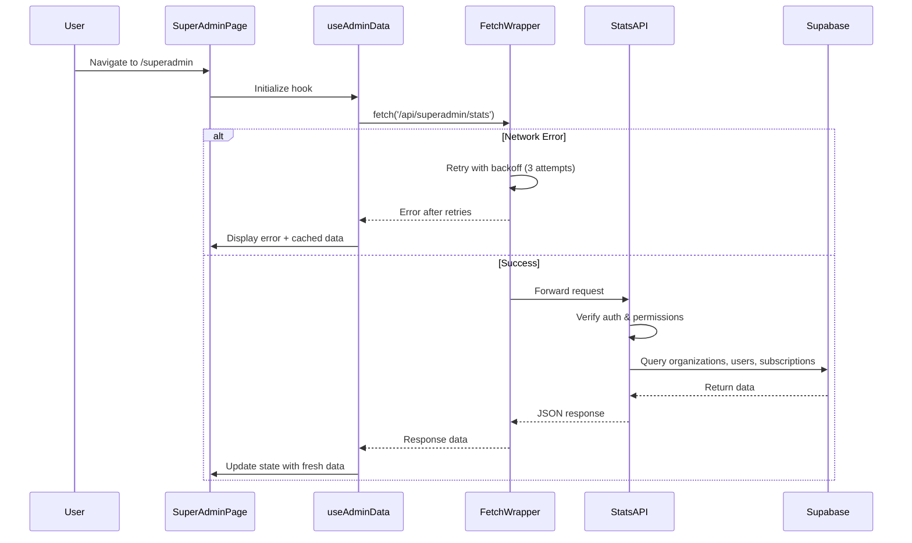
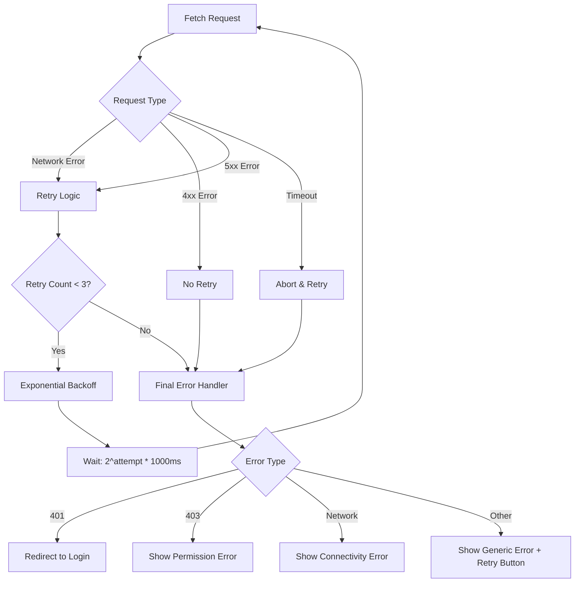
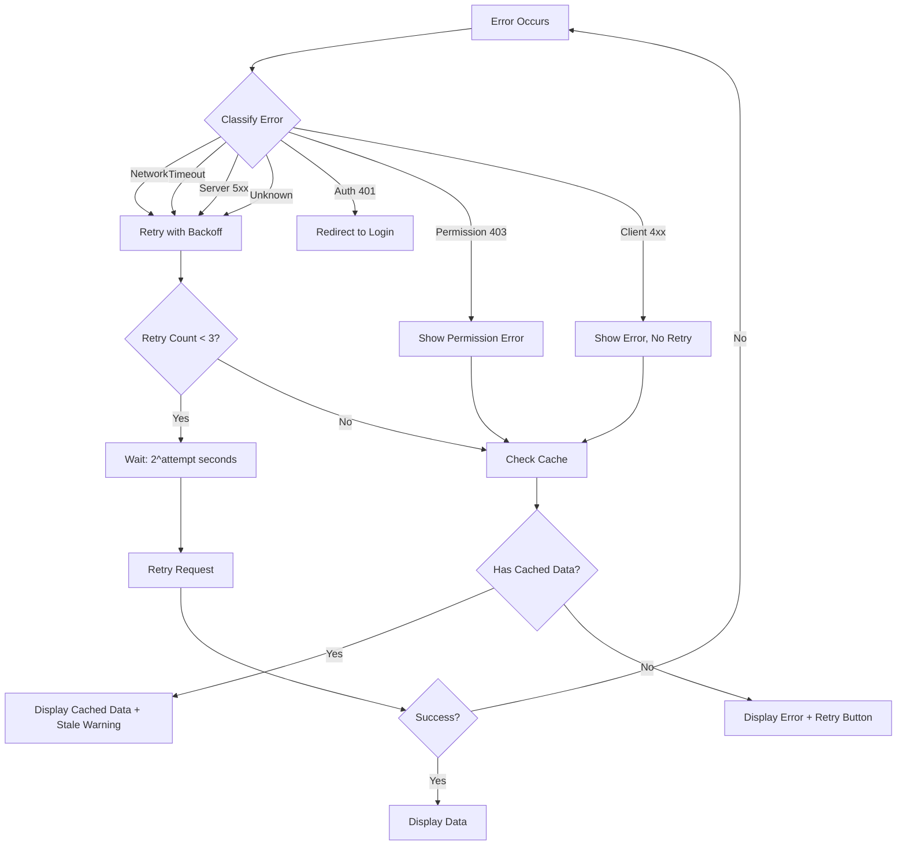

# Design Document: Fix Superadmin Fetch Error

## Overview

This design addresses the "Failed to fetch" error occurring in the superadmin area when loading dashboard data. The error originates from the `useAdminData` hook's attempt to fetch statistics from `/api/superadmin/stats`, with the request passing through a custom fetch wrapper that manages global loading states.

The solution implements a multi-layered approach:
1. **Enhanced diagnostics** to identify the root cause through comprehensive logging
2. **Retry logic with exponential backoff** to handle transient network failures
3. **Improved error handling** to provide clear user feedback
4. **Fetch wrapper fixes** to prevent interference with API requests
5. **Graceful degradation** to maintain partial functionality when data loading fails

The design prioritizes reliability and user experience while maintaining backward compatibility with existing code.

## Architecture

### Component Interaction Flow



### Error Handling Architecture



## Components and Interfaces

### 1. Enhanced Fetch Wrapper

**Location:** `apps/frontend/src/components/providers.tsx`

**Purpose:** Wrap native fetch with retry logic, timeout handling, and improved error diagnostics.

**Interface:**
```typescript
interface FetchWrapperConfig {
  maxRetries: number;
  retryDelay: (attempt: number) => number;
  timeout: number;
  shouldRetry: (error: Error, response?: Response) => boolean;
}

interface FetchContext {
  url: string;
  method: string;
  startTime: number;
  attempt: number;
  isApiCall: boolean;
}
```

**Key Changes:**
- Add retry logic with exponential backoff (1s, 2s, 4s)
- Implement request timeout (15 seconds)
- Enhance error logging with request context
- Fix loading state management for concurrent requests
- Preserve original fetch behavior for non-API calls

**Pseudocode:**
```
function createEnhancedFetch(originalFetch):
  return async function enhancedFetch(input, init):
    context = extractRequestContext(input, init)
    
    for attempt in 1 to MAX_RETRIES:
      try:
        logRequestStart(context, attempt)
        
        // Create timeout controller
        timeoutController = new AbortController()
        timeoutId = setTimeout(() => timeoutController.abort(), TIMEOUT_MS)
        
        // Merge abort signals
        combinedSignal = combineAbortSignals([
          init?.signal,
          timeoutController.signal
        ])
        
        // Execute fetch with timeout
        response = await originalFetch(input, {
          ...init,
          signal: combinedSignal
        })
        
        clearTimeout(timeoutId)
        logRequestSuccess(context, response)
        
        return response
        
      catch error:
        clearTimeout(timeoutId)
        
        if error.name === 'AbortError':
          if isTimeout(error):
            logTimeout(context)
          else:
            logAbort(context)
        
        shouldRetry = attempt < MAX_RETRIES && isRetryableError(error)
        
        if shouldRetry:
          delay = calculateBackoff(attempt)
          logRetryAttempt(context, attempt, delay)
          await sleep(delay)
          continue
        else:
          logFinalError(context, error)
          throw error
```

### 2. Retry Utility

**Location:** `apps/frontend/src/lib/fetch-retry.ts` (new file)

**Purpose:** Provide reusable retry logic with exponential backoff.

**Interface:**
```typescript
interface RetryOptions {
  maxAttempts: number;
  initialDelay: number;
  maxDelay: number;
  backoffMultiplier: number;
  shouldRetry: (error: Error, attempt: number) => boolean;
  onRetry?: (error: Error, attempt: number, delay: number) => void;
}

async function fetchWithRetry<T>(
  fetcher: () => Promise<T>,
  options: Partial<RetryOptions>
): Promise<T>
```

**Implementation:**
```
function fetchWithRetry(fetcher, options):
  mergedOptions = mergeWithDefaults(options)
  lastError = null
  
  for attempt in 1 to mergedOptions.maxAttempts:
    try:
      result = await fetcher()
      return result
      
    catch error:
      lastError = error
      
      if attempt >= mergedOptions.maxAttempts:
        throw error
      
      if not mergedOptions.shouldRetry(error, attempt):
        throw error
      
      delay = calculateExponentialBackoff(
        attempt,
        mergedOptions.initialDelay,
        mergedOptions.maxDelay,
        mergedOptions.backoffMultiplier
      )
      
      mergedOptions.onRetry?.(error, attempt, delay)
      await sleep(delay)
  
  throw lastError

function calculateExponentialBackoff(attempt, initial, max, multiplier):
  delay = initial * Math.pow(multiplier, attempt - 1)
  return Math.min(delay, max)

function isRetryableError(error, response):
  // Network errors are retryable
  if error.name === 'TypeError' and error.message.includes('fetch'):
    return true
  
  // Timeout errors are retryable
  if error.name === 'AbortError':
    return true
  
  // 5xx errors are retryable
  if response and response.status >= 500:
    return true
  
  // 408 (Timeout) and 429 (Rate Limit) are retryable
  if response and (response.status === 408 or response.status === 429):
    return true
  
  // 4xx errors are not retryable (except 408, 429)
  if response and response.status >= 400 and response.status < 500:
    return false
  
  return false
```

### 3. Enhanced useAdminData Hook

**Location:** `apps/frontend/src/app/superadmin/hooks/useAdminData.ts`

**Purpose:** Fetch and manage superadmin data with improved error handling and caching.

**Interface:**
```typescript
interface UseAdminDataReturn {
  organizations: Organization[];
  stats: AdminStats;
  loading: boolean;
  refreshing: boolean;
  error: ErrorState | null;
  lastFetch: Date | null;
  cachedData: CachedData | null;
  refresh: () => Promise<void>;
  clearError: () => void;
}

interface ErrorState {
  type: 'network' | 'auth' | 'permission' | 'timeout' | 'server' | 'unknown';
  message: string;
  statusCode?: number;
  retryable: boolean;
  timestamp: Date;
}

interface CachedData {
  organizations: Organization[];
  stats: AdminStats;
  timestamp: Date;
  isStale: boolean;
}
```

**Key Changes:**
- Add structured error state with error types
- Implement data caching with staleness indicators
- Add manual retry capability
- Improve logging with request lifecycle tracking
- Handle partial data loading gracefully

**Pseudocode:**
```
function useAdminData(options):
  state = {
    organizations: [],
    stats: defaultStats,
    loading: true,
    error: null,
    cachedData: loadFromLocalStorage(),
    lastFetch: null
  }
  
  async function fetchData(isRefresh):
    try:
      logFetchStart(isRefresh)
      
      if isRefresh:
        state.refreshing = true
      else:
        state.loading = true
      
      state.error = null
      
      // Fetch stats with retry
      statsData = await fetchWithRetry(
        () => fetch('/api/superadmin/stats').then(r => r.json()),
        {
          maxAttempts: 3,
          shouldRetry: isRetryableError,
          onRetry: logRetryAttempt
        }
      )
      
      // Fetch organizations from Supabase
      orgsData = await supabase
        .from('organizations')
        .select('*')
        .order('created_at', { ascending: false })
      
      // Update state
      state.organizations = orgsData || []
      state.stats = statsData
      state.lastFetch = new Date()
      
      // Cache data
      cacheData(state.organizations, state.stats)
      
      logFetchSuccess()
      options.onSuccess?.()
      
    catch error:
      logFetchError(error)
      
      errorState = classifyError(error)
      state.error = errorState
      
      // Use cached data if available
      if state.cachedData:
        state.organizations = state.cachedData.organizations
        state.stats = state.cachedData.stats
        state.cachedData.isStale = true
      
      options.onError?.(errorState.message)
      
    finally:
      state.loading = false
      state.refreshing = false
  
  function classifyError(error):
    if error.name === 'AbortError':
      return {
        type: 'timeout',
        message: 'Request timed out. Please try again.',
        retryable: true
      }
    
    if error.message.includes('fetch failed'):
      return {
        type: 'network',
        message: 'Network error. Please check your connection.',
        retryable: true
      }
    
    if error.statusCode === 401:
      return {
        type: 'auth',
        message: 'Session expired. Please log in again.',
        retryable: false
      }
    
    if error.statusCode === 403:
      return {
        type: 'permission',
        message: 'Insufficient permissions.',
        retryable: false
      }
    
    if error.statusCode >= 500:
      return {
        type: 'server',
        message: 'Server error. Please try again later.',
        retryable: true
      }
    
    return {
      type: 'unknown',
      message: error.message || 'An error occurred.',
      retryable: true
    }
  
  return state
```

### 4. Error Display Component

**Location:** `apps/frontend/src/app/superadmin/components/ErrorDisplay.tsx` (new file)

**Purpose:** Display user-friendly error messages with actionable guidance.

**Interface:**
```typescript
interface ErrorDisplayProps {
  error: ErrorState;
  onRetry?: () => void;
  onDismiss?: () => void;
  showCachedDataWarning?: boolean;
}
```

**Pseudocode:**
```
function ErrorDisplay({ error, onRetry, onDismiss, showCachedDataWarning }):
  icon = getErrorIcon(error.type)
  title = getErrorTitle(error.type)
  actions = getErrorActions(error)
  
  return (
    <Alert variant="destructive">
      <Icon>{icon}</Icon>
      <AlertTitle>{title}</AlertTitle>
      <AlertDescription>
        {error.message}
        
        if showCachedDataWarning:
          <Text>Showing cached data from {formatTime(cachedTimestamp)}</Text>
        
        <ActionButtons>
          if error.retryable and onRetry:
            <Button onClick={onRetry}>Retry</Button>
          
          if error.type === 'auth':
            <Button onClick={redirectToLogin}>Log In</Button>
          
          if error.type === 'permission':
            <Button onClick={contactSupport}>Contact Support</Button>
          
          if onDismiss:
            <Button variant="ghost" onClick={onDismiss}>Dismiss</Button>
        </ActionButtons>
      </AlertDescription>
    </Alert>
  )
```

### 5. Enhanced Logging System

**Location:** `apps/frontend/src/lib/logger.ts` (new file)

**Purpose:** Provide structured logging for debugging fetch issues.

**Interface:**
```typescript
interface LogContext {
  component: string;
  action: string;
  metadata?: Record<string, any>;
}

interface Logger {
  info(message: string, context?: LogContext): void;
  warn(message: string, context?: LogContext): void;
  error(message: string, error: Error, context?: LogContext): void;
  debug(message: string, context?: LogContext): void;
}
```

**Implementation:**
```
class StructuredLogger:
  function info(message, context):
    console.log(`ℹ️ [${context.component}] ${message}`, context.metadata)
  
  function warn(message, context):
    console.warn(`⚠️ [${context.component}] ${message}`, context.metadata)
  
  function error(message, error, context):
    console.error(`❌ [${context.component}] ${message}`, {
      error: {
        name: error.name,
        message: error.message,
        stack: error.stack
      },
      ...context.metadata
    })
  
  function debug(message, context):
    if process.env.NODE_ENV === 'development':
      console.debug(`🔍 [${context.component}] ${message}`, context.metadata)

// Usage
logger.info('Fetching admin data', {
  component: 'useAdminData',
  action: 'fetchData',
  metadata: { isRefresh: false }
})
```

## Data Models

### ErrorState

```typescript
interface ErrorState {
  type: 'network' | 'auth' | 'permission' | 'timeout' | 'server' | 'unknown';
  message: string;
  statusCode?: number;
  retryable: boolean;
  timestamp: Date;
  context?: {
    url?: string;
    method?: string;
    attempt?: number;
  };
}
```

### CachedData

```typescript
interface CachedData {
  organizations: Organization[];
  stats: AdminStats;
  timestamp: Date;
  isStale: boolean;
  version: string; // For cache invalidation
}
```

### FetchMetrics

```typescript
interface FetchMetrics {
  url: string;
  method: string;
  startTime: number;
  endTime?: number;
  duration?: number;
  statusCode?: number;
  attempt: number;
  success: boolean;
  errorType?: string;
}
```


## Correctness Properties

*A property is a characteristic or behavior that should hold true across all valid executions of a system—essentially, a formal statement about what the system should do. Properties serve as the bridge between human-readable specifications and machine-verifiable correctness guarantees.*

### Logging and Diagnostics

**Property 1: Comprehensive Request Logging**
*For any* fetch request (successful or failed), the system SHALL log the complete request lifecycle including method, URL, headers, start time, end time, duration, response status, and any errors encountered.
**Validates: Requirements 1.1, 1.3, 1.5, 9.1, 9.2, 9.3**

**Property 2: Error Context Logging**
*For any* error that occurs during fetch operations, the system SHALL log the error type, message, stack trace, and request context (URL, method, attempt number).
**Validates: Requirements 1.1, 9.3**

**Property 3: Authentication Logging**
*For any* authentication or permission check, the system SHALL log the user ID, email, role verification method attempted, and the result of the check.
**Validates: Requirements 1.2, 6.5, 9.4**

**Property 4: Database Query Logging**
*For any* Supabase query, the system SHALL log the table name, query type, row count (if successful), and error details (if failed) including error code, message, details, and hint.
**Validates: Requirements 8.4, 9.5**

**Property 5: Consistent Log Formatting**
*For any* log entry, the system SHALL use consistent prefixes (🔍 for info, ✅ for success, ❌ for errors, ⚠️ for warnings) to enable easy filtering and debugging.
**Validates: Requirements 9.6**

### Error Handling and User Feedback

**Property 6: User-Friendly Error Messages**
*For any* fetch failure, the system SHALL display a user-friendly error message that describes the problem and includes actionable guidance (e.g., "Retry", "Check connection", "Contact support") appropriate to the error type.
**Validates: Requirements 2.1, 2.6**

**Property 7: Error Classification**
*For any* error, the system SHALL correctly classify it as one of: network, auth, permission, timeout, server, or unknown, and SHALL distinguish between network failures and API errors.
**Validates: Requirements 1.4**

### Retry Logic

**Property 8: Network Error Retry**
*For any* fetch request that fails due to network issues, the system SHALL automatically retry the request up to 3 times before displaying the final error.
**Validates: Requirements 3.1**

**Property 9: Exponential Backoff**
*For any* retry sequence, the system SHALL use exponential backoff with delays of 1 second (first retry), 2 seconds (second retry), and 4 seconds (third retry), and SHALL log each retry attempt with timing information.
**Validates: Requirements 3.2, 3.6**

**Property 10: Client Error No-Retry**
*For any* fetch request that fails with a 4xx status code (except 408 Request Timeout and 429 Too Many Requests), the system SHALL NOT retry the request.
**Validates: Requirements 3.3**

**Property 11: Server Error Retry**
*For any* fetch request that fails with a 5xx status code, the system SHALL retry the request according to the retry policy.
**Validates: Requirements 3.4**

**Property 12: Exhausted Retries Error Display**
*For any* fetch request where all retry attempts are exhausted, the system SHALL display the final error to the user with appropriate error messaging.
**Validates: Requirements 3.5**

### Timeout Handling

**Property 13: Request Timeout and Cleanup**
*For any* fetch request that exceeds 15 seconds, the system SHALL abort the request, clean up all associated resources (abort controllers, timers, loading states), log the timeout with URL and duration, and display a timeout error to the user.
**Validates: Requirements 7.1, 7.2, 7.3**

**Property 14: Component Unmount Cleanup**
*For any* component using the fetch hook, when the component unmounts, the system SHALL abort all pending requests and clean up associated resources.
**Validates: Requirements 7.5**

### Fetch Wrapper Behavior

**Property 15: Fetch Behavior Preservation**
*For any* valid fetch request, the patched fetch wrapper SHALL preserve all original fetch behavior including headers, body, response handling, and error propagation without modification.
**Validates: Requirements 5.1, 5.5**

**Property 16: Concurrent Request Tracking**
*For any* set of concurrent fetch requests, the system SHALL correctly track the active request count, incrementing when requests start and decrementing when they complete or fail.
**Validates: Requirements 5.3**

**Property 17: Abort Cleanup**
*For any* aborted request, the system SHALL properly clean up loading states without throwing additional errors.
**Validates: Requirements 5.2**

**Property 18: Watchdog Non-Interference**
*For any* pending request, when the watchdog timer fires, the system SHALL log a warning but SHALL NOT interfere with the pending request's execution or result.
**Validates: Requirements 5.4**

### Authentication and Authorization

**Property 19: Permission Check Sequence**
*For any* superadmin permission verification, the system SHALL check permissions in the following order: user_roles table, users table, user metadata, and SHALL log which method was attempted.
**Validates: Requirements 6.4, 6.5**

### Supabase Client Behavior

**Property 20: Admin Client RLS Bypass**
*For any* query using the admin client (organizations, users, subscriptions), the query SHALL successfully bypass Row Level Security policies and return data regardless of the user's RLS permissions.
**Validates: Requirements 8.1**

**Property 21: Regular Client Authentication**
*For any* request using the regular Supabase client, the client SHALL verify user authentication before executing the request.
**Validates: Requirements 8.3**

### Graceful Degradation and Caching

**Property 22: Data Caching**
*For any* successful data fetch, the system SHALL cache the data (organizations and stats) with a timestamp, and SHALL display cached data with a "stale data" indicator when fresh data fails to load.
**Validates: Requirements 10.4**

**Property 23: Partial Data Display**
*For any* scenario where partial data is available (either stats or organizations but not both), the system SHALL display the available data and indicate which sections failed to load.
**Validates: Requirements 10.5**


## Error Handling

### Error Classification Strategy

The system classifies errors into six categories, each with specific handling:

1. **Network Errors** (`type: 'network'`)
   - **Detection:** `error.name === 'TypeError'` and `error.message.includes('fetch failed')`
   - **Handling:** Retry up to 3 times with exponential backoff
   - **User Message:** "Network error. Please check your connection and try again."
   - **Actions:** Retry button, Check connection guidance

2. **Authentication Errors** (`type: 'auth'`)
   - **Detection:** HTTP 401 status code
   - **Handling:** No retry, redirect to login
   - **User Message:** "Your session has expired. Please log in again."
   - **Actions:** Log In button

3. **Permission Errors** (`type: 'permission'`)
   - **Detection:** HTTP 403 status code
   - **Handling:** No retry, display permission denied
   - **User Message:** "You don't have permission to access this resource."
   - **Actions:** Contact Support button

4. **Timeout Errors** (`type: 'timeout'`)
   - **Detection:** `error.name === 'AbortError'` from timeout controller
   - **Handling:** Retry up to 3 times
   - **User Message:** "The request timed out. Please try again."
   - **Actions:** Retry button

5. **Server Errors** (`type: 'server'`)
   - **Detection:** HTTP 5xx status codes
   - **Handling:** Retry up to 3 times with exponential backoff
   - **User Message:** "Server error. Please try again in a moment."
   - **Actions:** Retry button

6. **Unknown Errors** (`type: 'unknown'`)
   - **Detection:** Any error not matching above categories
   - **Handling:** Retry up to 3 times
   - **User Message:** "An unexpected error occurred. Please try again."
   - **Actions:** Retry button, Contact Support button

### Error Recovery Flow



### Logging Strategy

All errors are logged with structured context:

```typescript
{
  timestamp: Date,
  level: 'error' | 'warn' | 'info',
  component: string,
  action: string,
  error: {
    type: string,
    name: string,
    message: string,
    stack?: string,
    statusCode?: number
  },
  context: {
    url?: string,
    method?: string,
    attempt?: number,
    userId?: string,
    duration?: number
  }
}
```

### Fallback Mechanisms

1. **Cached Data Fallback**
   - When fresh data fails to load, display cached data from localStorage
   - Show "Last updated: [timestamp]" indicator
   - Provide manual refresh button

2. **Partial Data Display**
   - If stats fail but organizations succeed, show organizations with default stats
   - If organizations fail but stats succeed, show stats with empty organizations table
   - Always indicate which sections are unavailable

3. **Graceful UI Degradation**
   - Never show blank screens
   - Always provide actionable next steps
   - Maintain navigation and core functionality

## Testing Strategy

### Dual Testing Approach

This feature requires both unit tests and property-based tests to ensure comprehensive coverage:

- **Unit tests** verify specific examples, edge cases, and error conditions
- **Property tests** verify universal properties across all inputs
- Together they provide comprehensive coverage: unit tests catch concrete bugs, property tests verify general correctness

### Property-Based Testing

**Library:** We'll use `fast-check` for TypeScript/JavaScript property-based testing.

**Configuration:**
- Minimum 100 iterations per property test (due to randomization)
- Each property test references its design document property
- Tag format: `// Feature: fix-superadmin-fetch-error, Property {number}: {property_text}`

**Property Test Examples:**

```typescript
// Feature: fix-superadmin-fetch-error, Property 8: Network Error Retry
test('network errors trigger exactly 3 retry attempts', async () => {
  await fc.assert(
    fc.asyncProperty(
      fc.string(), // URL
      fc.record({ method: fc.constantFrom('GET', 'POST', 'PUT', 'DELETE') }), // options
      async (url, options) => {
        let attemptCount = 0;
        const mockFetch = jest.fn().mockImplementation(() => {
          attemptCount++;
          throw new TypeError('fetch failed');
        });
        
        try {
          await fetchWithRetry(() => mockFetch(url, options), {
            maxAttempts: 3,
            shouldRetry: isRetryableError
          });
        } catch (e) {
          // Expected to fail after retries
        }
        
        expect(attemptCount).toBe(3);
      }
    ),
    { numRuns: 100 }
  );
});

// Feature: fix-superadmin-fetch-error, Property 9: Exponential Backoff
test('retries use exponential backoff timing', async () => {
  await fc.assert(
    fc.asyncProperty(
      fc.string(),
      async (url) => {
        const delays: number[] = [];
        const startTimes: number[] = [];
        
        const mockFetch = jest.fn().mockImplementation(() => {
          startTimes.push(Date.now());
          throw new TypeError('fetch failed');
        });
        
        try {
          await fetchWithRetry(() => mockFetch(url), {
            maxAttempts: 3,
            initialDelay: 1000,
            onRetry: (error, attempt, delay) => delays.push(delay)
          });
        } catch (e) {
          // Expected
        }
        
        // Verify delays are 1s, 2s, 4s (with tolerance for execution time)
        expect(delays[0]).toBeCloseTo(1000, -2);
        expect(delays[1]).toBeCloseTo(2000, -2);
        expect(delays[2]).toBeCloseTo(4000, -2);
      }
    ),
    { numRuns: 100 }
  );
});

// Feature: fix-superadmin-fetch-error, Property 15: Fetch Behavior Preservation
test('patched fetch preserves original fetch behavior', async () => {
  await fc.assert(
    fc.asyncProperty(
      fc.string({ minLength: 1 }), // URL
      fc.record({
        method: fc.constantFrom('GET', 'POST', 'PUT', 'DELETE'),
        headers: fc.dictionary(fc.string(), fc.string()),
        body: fc.option(fc.string())
      }),
      async (url, options) => {
        const mockResponse = { ok: true, status: 200, json: async () => ({ data: 'test' }) };
        const originalFetch = jest.fn().mockResolvedValue(mockResponse);
        const patchedFetch = createEnhancedFetch(originalFetch);
        
        const result = await patchedFetch(url, options);
        
        // Verify same response
        expect(result).toEqual(mockResponse);
        // Verify original fetch was called with same arguments
        expect(originalFetch).toHaveBeenCalledWith(
          url,
          expect.objectContaining({
            method: options.method,
            headers: options.headers,
            body: options.body
          })
        );
      }
    ),
    { numRuns: 100 }
  );
});
```

### Unit Testing

**Focus Areas:**
1. **Specific Error Scenarios**
   - Test 401 redirects to login
   - Test 403 shows permission error
   - Test 404 shows not found error
   - Test network error shows connectivity message

2. **Edge Cases**
   - Empty response bodies
   - Malformed JSON responses
   - Missing environment variables
   - Expired sessions
   - Concurrent request race conditions

3. **Integration Points**
   - Supabase client initialization
   - React Query integration
   - LocalStorage caching
   - Component lifecycle (mount/unmount)

**Unit Test Examples:**

```typescript
describe('useAdminData error handling', () => {
  it('redirects to login on 401 error', async () => {
    const mockFetch = jest.fn().mockResolvedValue({
      ok: false,
      status: 401,
      json: async () => ({ error: 'Unauthorized' })
    });
    
    const { result } = renderHook(() => useAdminData());
    
    await waitFor(() => {
      expect(result.current.error?.type).toBe('auth');
      expect(mockRouter.push).toHaveBeenCalledWith('/login');
    });
  });
  
  it('displays cached data when fresh data fails', async () => {
    const cachedData = { organizations: [{ id: '1', name: 'Test' }], stats: {} };
    localStorage.setItem('admin-data-cache', JSON.stringify(cachedData));
    
    const mockFetch = jest.fn().mockRejectedValue(new TypeError('fetch failed'));
    
    const { result } = renderHook(() => useAdminData());
    
    await waitFor(() => {
      expect(result.current.organizations).toEqual(cachedData.organizations);
      expect(result.current.cachedData?.isStale).toBe(true);
    });
  });
});
```

### Test Coverage Goals

- **Line Coverage:** > 90%
- **Branch Coverage:** > 85%
- **Function Coverage:** > 90%
- **Property Test Coverage:** All 23 correctness properties must have corresponding property tests

### Testing Checklist

- [ ] All 23 correctness properties have property-based tests
- [ ] All error types (network, auth, permission, timeout, server, unknown) have unit tests
- [ ] Retry logic is tested with both property tests and unit tests
- [ ] Timeout handling is tested with simulated delays
- [ ] Concurrent request tracking is tested with multiple simultaneous requests
- [ ] Cache behavior is tested with localStorage mocking
- [ ] Component lifecycle (mount/unmount) is tested
- [ ] API endpoint authentication and authorization are tested
- [ ] Supabase client RLS bypass is tested
- [ ] Logging output is verified in tests
